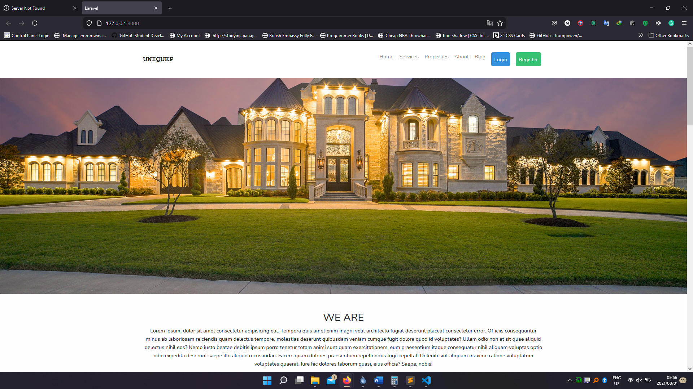
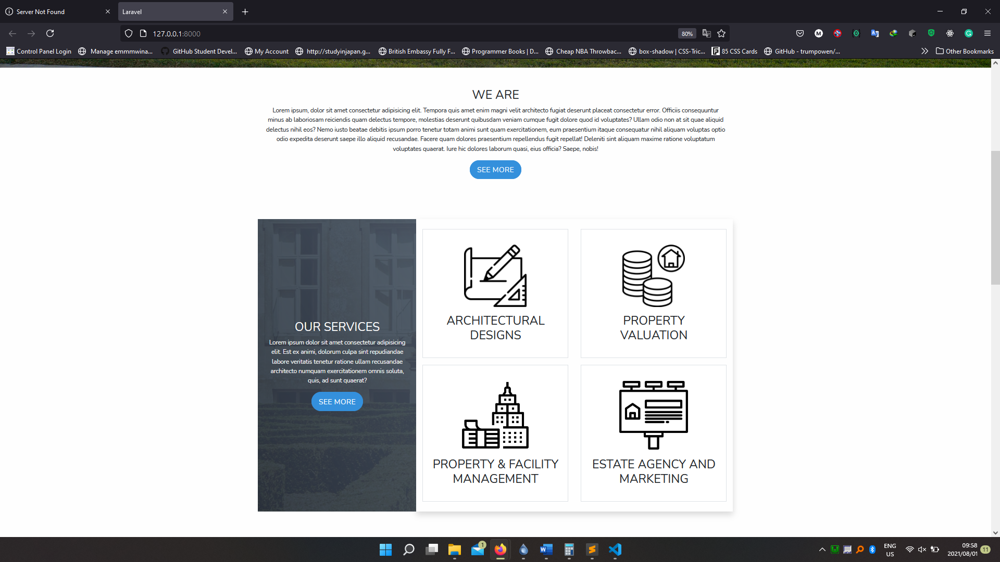
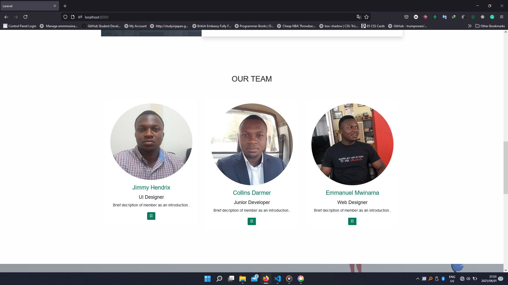
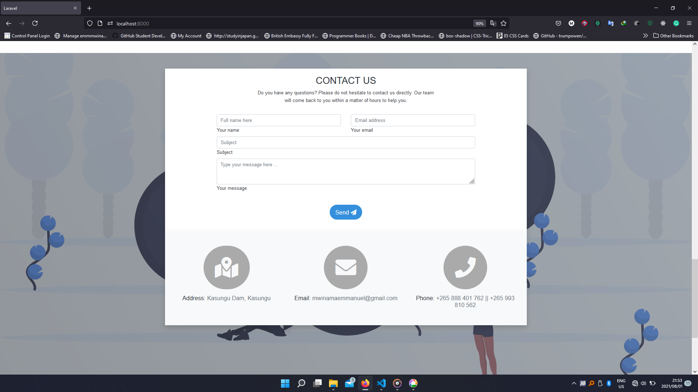
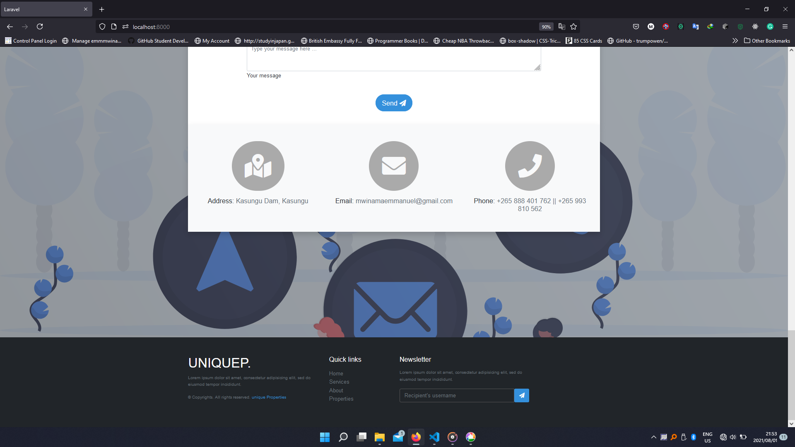
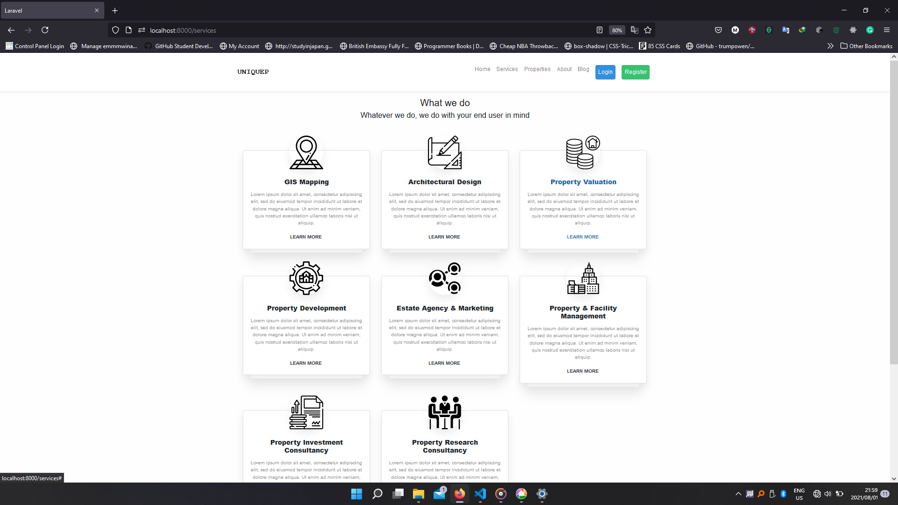
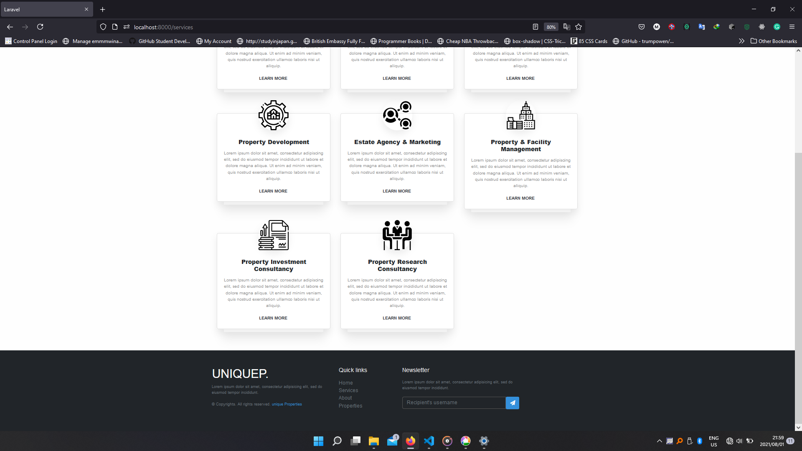
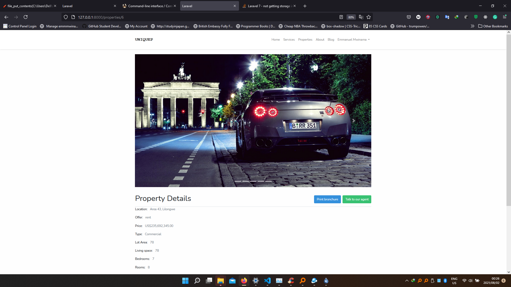
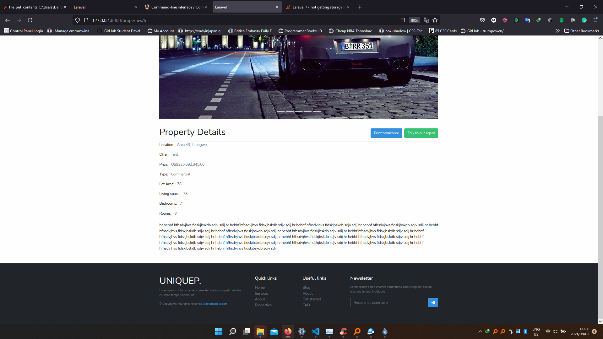

# Unique Consultancy Website

This website was developed to serve as face of a consultancy company called **Unique Property Consultancy**. It has been developed in using a number of technologies the main ones being: Laravel 7, MySql and Bootstrap. The purpose of this document is to give you a walkthrough of the system and the intended functions of different aspects of the website.

> You will notice that the website text and interfaces are still occupied by placeholders and this is because the actual data from the client has not been sent. It should be easy to get what each section or component contains.

## Home Page

This is the landing page of the site and it has some introductory sections that lead to their respective pages and content on the website. Below are screenshots of the landing page as portrayed on the site.

### Screen captures

## Services page

This page captures the services that are being offered by Unique Property Consultancy. The description of the services have also been replaced with dummy data.

### Screen captures

## Properties page

This is the most important page on the entire site as it serves the primary purpose of the site which is to act as a marketing platform for properties that have been offered for sale or rent.

### Screen captures

> To run this on your machine, make sure you have Php 7.2.5
>
> Please follow and execute the following in the project folder
>> 1. composer install
>>
>> 2. npm install
>>
>> 3. php artisan storage:link

Now you are ready to run the application using 
>   php artisan migrate
>
>   php artisan serve
